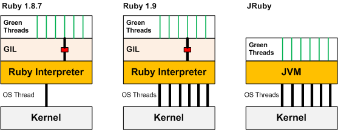

!SLIDE
# Programação Web Assíncrona com Goliath #

!SLIDE bullets
# Cainã Costa #
* @sryche

!SLIDE bullets
# Disclaimer #
* Minha primeira palestra na vida.

!SLIDE center
# EVENTOS!!!1!onze!1 #

!SLIDE
# EventMachine #

* Muito tempo perdido esperando I/O (Aplicações I/O Bound)
* Pouco tempo de real processamento

!SLIDE
# EventMachine #

* Peça por I/O
* Processe outras coisas
* Quando o I/O voltar, continue o que estava fazendo

!SLIDE
# Callbacks! #

!SLIDE
# Eventos são maneiros, mas... #

* Eles são difíceis de testar
* Eles são difíceis de acompanhar
* Eles não são o que estamos acostumados...

!SLIDE bullets incremental

# Podemos simplesmente nos acostumar com o modelo evented! #

* Mas qual a graça disso?

!SLIDE
# Existe outra solução? #

!SLIDE

# Fibers ao resgate! #

!SLIDE center

!SLIDE
# Threads no MRI não são concorrentes! #
* (jRuby e Rubinius 2.0 escapam dessa)

!SLIDE center
# Global Interpreter Lock #

!SLIDE
# Fair Scheduler #
* Cada Thread tem um tempo (10ms) para rodar
* Após isso, ela é interrompida e a próxima toma seu lugar

!SLIDE
# Fibers #
* Funcionam de maneiras parecidas com Threads
* O scheduling fica a cargo do programador
* Mais leve/rápido, mas mais complexo
* Sem concorrência

!SLIDE center
# Fibers vs Threads #

!SLIDE
# Beleza, mas pra que serve? #

!SLIDE
# EventMachine! #
* O EM roda I/Os em Threads separadas, e retorna um callback quando terminam
* Podemos colocar todo nosso código em Fibers, parar e resumir quando acabar

!SLIDE

# Podemos transformar isso... #

    @@@ ruby
    require 'eventmachine'
    require 'em-http'

    EM.run do
      url = "http://jsonip.com"
      http = EM::HttpRequest.new(url).get timeout: 10
      http.callback do |data|
        url = "http://localhost:9292"
        http = EM::HttpRequest.new(url).post timeout: 10,
                                                    body: {ip: data.response}

        http.callback do |data|
          puts data.response

          EM.stop
        end
      end
    end

!SLIDE

# Nisso! Look, ma! No callbacks! #

    @@@ ruby
    require 'fiber'
    require 'eventmachine'
    require 'em-http'

    def async_fetch(url, method = :get, params = {timeout: 10})
      f = Fiber.current
      http = EM::HttpRequest.new(url).send(method, params)
      http.callback { f.resume(http) }

      return Fiber.yield
    end

    EM.run do
      Fiber.new{
        puts "Setting up HTTP request #1"
        data = async_fetch('http://jsonip.com/')

        post = async_fetch('http://localhost:9292/',
                           :post, timeout: 10, body: {ip: data.response})

        puts post.response

        EM.stop
      }.resume
    end

!SLIDE

# Yay! #

    @@@ ruby
    data = async_fetch('http://jsonip.com/')

    post = async_fetch('http://localhost:9292/',
        :post, timeout: 10, body: {ip: data.response})

    puts post.response

!SLIDE

# EventMachine::Synchrony

!SLIDE

# Lembra do nosso exemplo? Então... #

    @@@ ruby
    EM.run do
      EM.synchrony do
        data = EM::HttpRequest.new('http://jsonip.com/').get

        post = EM::HttpRequest.new('http://localhost:9292/').
                               post(timeout: 10, body: {ip: data.response})

        puts post.response

        EM.stop
      end
    end

!SLIDE
# O EM::Synchrony cuida da parte complicada pra gente...
* Coloca o bloco inteiro dentro de uma Fiber
* Cuida do scheduling da Fiber para parar/retornar assim que um I/O blocante ocorrer

!SLIDE
# Mas e se isso fosse aplicado para o Rack? #

!SLIDE
# Goliath! #

!SLIDE
# EventMachine + HTTP Parser rápido + Fibers = <3 #

!SLIDE incremental
# Goliath::API #
* Classe principal de uma aplicação
